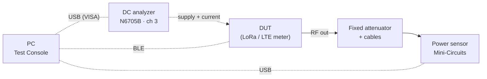
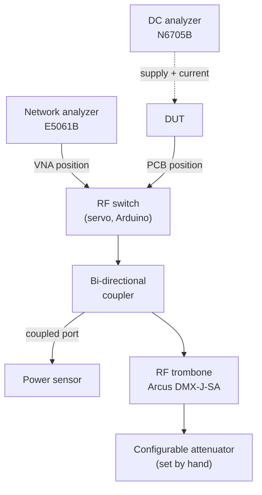
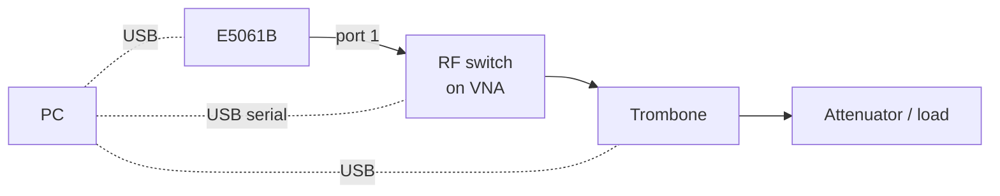
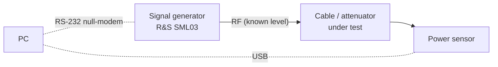

# 2. Hardware & connections

[← 1. Installation](01-installation-and-configuration.md) · [Contents](README.md) · Next: [3. Using the console →](03-using-the-console.md)

- [2.1 Supported devices](#21-supported-devices)
- [2.2 Device details](#22-device-details)
- [2.3 The DUT over BLE](#23-the-dut-over-ble)
- [2.4 Test setups](#24-test-setups)
- [2.5 Which test needs what](#25-which-test-needs-what)

---

## 2.1 Supported devices

| Device | Model | Interface | Address you give the app | Driver |
|---|---|---|---|---|
| Power sensor | Mini-Circuits USB smart power sensor (PWR-SEN-4GHS / PWR-6GHS; 9 kHz – 4 GHz) | USB, via the vendor .NET DLL (not VISA) | Sensor serial number, e.g. `11501120012`. Leave blank to use the first sensor found. | Bundled `mcl_pm_NET45.dll` |
| DC power analyzer | Keysight **N6705B** | USB-TMC over VISA | `USB0::0x0957::0x0F07::<serial>::0::INSTR`, plus a **channel** (1–4, default **3**) | Keysight IO Libraries |
| Network analyzer (VNA) | Agilent/Keysight **E5061B** ENA | USB-TMC over VISA | `USB0::0x0957::0x1309::<serial>::0::INSTR` | Keysight IO Libraries |
| Signal generator | Rohde & Schwarz **SML03** (9 kHz – 3.3 GHz) | RS-232 through pyserial, **null-modem cable** | COM port, e.g. `COM5`, plus a baud rate (default 9600) | USB-serial adapter driver |
| RF switch | Servo driven by an **Arduino** (FTDI FT232R, `VID_0403&PID_6001`) | USB serial, 9600 8N1 | COM port, e.g. `COM4` | FTDI VCP |
| RF trombone motor | Arcus **DMX-J-SA** stepper (3,200 pulses per revolution; 400 pulses/mm on the trombone) | USB, via `PerformaxCom.dll` | Device index 0–15 (the Instruments panel shows the product name, e.g. `jsa00`) | Arcus Performax USB (two-step install) |
| DUT | LoRa / LTE (Cat-M) meter | Bluetooth LE | MAC address, taken from a scan | Windows Bluetooth |
| Spectrum analyzer | R&S FSW26 | VISA | — | *Listed as "Coming Soon"; cannot be connected from the UI* |
| Configurable attenuator | 50PA-847 | — | — | *Listed as "Coming Soon"; set by hand* |

Each device's rows in the Instruments panel are shown in
[3.3](03-using-the-console.md#33-instruments-panel).

## 2.2 Device details

### Mini-Circuits power sensor

- **How to connect:** give it a serial number, or leave the field blank to
  take the first sensor found. Some DLL builds cannot connect by serial and
  quietly take the first sensor. If several sensors are plugged in, check the
  IDN shown after connecting.
- **Calibration frequency:** each test sets it to its own transmit frequency
  before reading. The Power Meter page does not set it.
- **No-signal reading:** a reading of **−100 dBm or lower** means *no
  signal*. The sensor reports about −997 dBm when it sees nothing. Test
  pages retry up to 12 times at 125 ms intervals (about 1.5 s) and then fail
  with "no signal at power sensor … increase the settle time". Mode Sweep
  retries 5 times at 100 ms.
- **Measurement range:** Load Pull colours readings by where they fall in
  the sensor's range. Raw readings above +10 dBm or below −20 dBm are
  marginal; above +16 dBm or below −25 dBm they are poor.

### Keysight N6705B DC power analyzer

- **Role:** supplies the DUT and measures its current (and voltage, where it
  is shown). Default channel is **3**.
- **Supply control:** the supply is switched from **Settings → DC ANALYZER
  SUPPLY** (see [3.5](03-using-the-console.md#35-settings)). The app never
  turns it on by itself.
- **Voltage scaling:** the backend halves the programmed voltage and doubles
  the read-back (`DC_VOLTAGE_SCALE = 2.0`), because this rig's hardware
  doubles it. The figure in the UI is the voltage at the DUT.
- **USB enumeration only happens at boot.** Connect the USB cable **before**
  powering the unit on. Hot-plugging a running instrument produces nothing.
  If it is missing: rear switch off, wait 30 s, switch on.
- **Discovery:** always press re-scan (↻) in the Instruments panel before connecting. The
  wrapper's built-in default address has a placeholder serial, and the real
  resource string carries an extra `::0::` field.

### Agilent/Keysight E5061B network analyzer

- **On connect,** the app sets internal trigger and continuous sweep
  (`TRIG:SOUR INT`, `INIT:CONT ON`). **The source is then transmitting for
  the whole time the VNA is connected.**
- **The app controls:** start and stop frequency, and up to 9 markers.
- **Set these on the front panel instead:** number of points, IF bandwidth
  and source power.
- **How markers are read:** they are kept on the PC and read from the swept
  S11/S21 trace at the nearest sweep point. The markers you see on the
  instrument's screen are only a courtesy copy.
- **Timeouts:** VISA commands time out after 10 s; trace reads after 30 s.

### R&S SML03 signal generator

- **Serial settings:** RS-232, 8N1, CR+LF line endings, DTR/RTS asserted.
  Baud rates offered: 1200, 2400, 4800, **9600**, 19200, 38400, 57600,
  115200. The rate must match **Utilities → System → RS232** on the
  instrument.
- **Cable:** a **null-modem** cable is required. If CTS and DSR both read
  low, the app says so; it means a straight-through cable, or the instrument
  is off.
- **Connecting changes nothing.** There is no reset and no output command.
- **Limits:** the app accepts 9 kHz – 3.3 GHz and −145 to +20 dBm. The
  datasheet maximum is +13 dBm; the extra headroom is left because these
  units can over-range.

### Arduino RF switch (servo)

- **Protocol:** ASCII, 9600 8N1, one command per line:
  - `<0–180>` moves to that angle;
  - `VNA` / `PCB` go to the stored presets;
  - `VNA SET` / `PCB SET` store the current position as a preset;
  - `*IDN?` identifies the board.
- **Presets live on the Arduino,** so they survive power cycles.
- **Opening the port without a reset:** the port is opened with DTR/RTS
  held low, so opening it does not reset the Arduino. Port scans list ports
  **without opening them**. Opening would reset the board, and on CH340
  adapters that can lock up the Windows driver ("PermissionError 13").
- **Position is not read back.** The app shows the last angle it commanded,
  or the angle the Arduino reports after moving to a preset.

### Arcus DMX-J-SA trombone motor

- **Settings applied on connect:** high speed 5,000 pulses/s, low speed 500,
  acceleration 300 ms, run current 2,000 mA, idle current 300 mA. Connecting
  **energises the motor**; disconnecting releases its holding torque.
- **Soft limits:** the controller has none of its own. They exist only once
  **Zero and End are both captured on the Load Pull page**, and they are
  held in backend memory. A backend restart clears them. **Until they are
  set, moves are not limited.**
- **After a power cycle,** the controller's position counter may no longer
  match the saved Zero/End. Recapture both.

### How instrument calls are serialised

Every instrument has its own single-thread queue with a 25 s timeout
(`backend/api/instruments/_bus.py`), because two callers on one VISA session
throw it out of step. If a call is still stuck after the timeout, further
calls to that instrument fail at once with *"…is not responding to a
previous command; disconnect and reconnect it"*. Disconnect and reconnect
that instrument; there is no need to restart the server.

## 2.3 The DUT over BLE

### Discovery

- **Name filter:** the scan lists every advertiser. The **Device type**
  selector then filters by advertised name (case-insensitive substring):

  | Device type | Matches names containing |
  |---|---|
  | All | anything |
  | CAT-M 2 | `CATM2` |
  | **Sonata 2 IL** (default) | `Sonata2IL` |
  | Interpreter G2 | `int2g` |

- **Connect timeout:** connecting looks for the device for up to 15 s.
- **Keep-alive:** while connected, the backend reads the GAP *Device Name*
  every 5 s to keep the link alive. It skips the read if a command ran in
  the last 5 s.
- **Unexpected drops:** if the link drops without the operator pressing
  Disconnect, the backend tries to reconnect 3 times, 2 s apart.

### Frame format

```
[opcode : 2 bytes][length : 2 bytes, little-endian][payload]
```

Multi-byte fields are little-endian. Byte 0 of the reply payload is the
status; `0` means OK. Only one command is in flight at a time, and the
default reply timeout is 5 s.

| Command | Opcode | Payload |
|---|---|---|
| LoRa TX Power (CW page) | `17 50` | freq_hz u32 · power_dbm u8 · pa_mode u8 (0 Off, 1 On, 2 Auto) |
| LoRa Modulated | `19 50` | bandwidth u8 (0 = 125 k, 1 = 250 k, 2 = 500 k; 0 for FSK) · freq_hz u32 · power u8 · modem u32 (0 FSK, 1 LoRa) · datarate u32 (SF or bit/s) |
| LoRa CW Debug | `28 50` | freq_hz u32 · pa_mode u8 · power u8 · pa_duty_cycle u8 · hp_max u8 |
| StopTest | `18 50` | empty |
| LTE Modem ON / OFF | `2B 50` / `2C 50` | empty (ON may take up to 10 s) |
| LTE CW | `24 50` | cmd u8 (3 start, 1 abort) · EARFCN u32 · time_ms u32 · power u32 in 0.01 dBm · offset_hz i32 |
| LTE Modulated | `23 50` | as CW up to the power field, then bandwidth · mcs · rb_count · rb_start · nb_index (u8 each) |

> After every **StopTest**, the backend makes the next command wait until
> 1.5 s have passed. Without that pause the DUT stops answering after two or
> three points and can drop the BLE link. That is why sweeps take about 2 s
> per point on top of the settle time.

### Meter information

The **(i)** button in the connection row reads these from the unit: Device
ID, firmware, MAC, App Mode, and the primary and secondary channel. It can
also write App Mode and the channels. See
[3.2](03-using-the-console.md#32-connecting-the-dut).

| Setting | Values |
|---|---|
| App modes | 0 Development, 1 ATE Tester, 2 Production, 3 Storage, 4 Deployment, 5 RF Test, 6 Test |
| Primary channel | NONE, CATM, LORA_FIXED |
| Secondary channel | NONE, LORA_DRIVEBY, OMS |

## 2.4 Test setups

The diagrams below show how the rig is cabled for each kind of test. Solid
lines carry RF, dashed lines carry DC, and dotted lines carry control
signals (USB, serial, BLE) back to the PC.

> **Path loss.** On every setup, the loss between the DUT's RF port and the
> power sensor (cables, attenuator, coupler, switch) is entered as **path
> loss** in the connection row. The app adds it to every sensor reading.
> Calibrate it at each test frequency, as described in
> [3.4](03-using-the-console.md#34-path-loss).

### A. LoRa / LTE TX tests: CW, Modulated, Debug, Mode Sweep



- **Required:** the BLE DUT. The power sensor and DC analyzer are needed for
  readings.
- **Without instruments:** the manual CW pages can transmit with the
  instruments unticked. Every other TX page offers **Send anyway / Run
  anyway**, which leaves the readings blank.
- **Mode Sweep** requires both instruments.
- **Before transmitting,** make sure the attenuator can take the DUT's
  maximum power, and that the sensor sees no more than its damage level.

### B. Load Pull

This is the app's own setup diagram. Open it with **View setup** on the Load
Pull page.


What a Load Pull run actually drives and reads:



Every instrument also connects to the PC:

| Instrument | Link to the PC |
|---|---|
| VNA, DC analyzer | USB (VISA) |
| Power sensor, trombone | USB |
| RF switch | USB serial |
| DUT | BLE |

- **Switch on VNA:** the analyzer measures the load the trombone presents,
  giving R, jX and S11.
- **Switch on PCB:** the DUT transmits into that load while power and
  current are measured.
- **Trombone:** changing its length moves the load *around* the Smith chart.
- **Attenuator:** changing it moves the load *inward or outward*.

> **Check the bench against these differences.** The drawing labels the
> analyzer N5224B, the supply N6705C, the trombone MT986A, and shows a
> spectrum analyzer (FSW26) on the coupler tap. The app itself drives an
> **E5061B**, an **N6705B** and an **Arcus DMX-J-SA**. It measures power with
> the **Mini-Circuits power sensor**; the page's own checklist reads "DUT to
> switch to coupler to power sensor". The spectrum analyzer is not used by
> any test yet.

### C. Network analyzer and trombone on their own



Use this with the Components pages to check the trombone's Smith-chart
circle by hand before a Load Pull. Press **Go VNA** on the Switch page first.

### D. Power meter and signal generator (bench checks)



A quick way to measure the path loss of a cable or attenuator:

1. Set a known level on the **Signal Generator** page and press **RF On**.
2. Read it on the **Power Meter** page.
3. The difference between the two is the path loss. Enter it in the path-loss
   table at that frequency.

## 2.5 Which test needs what

✔ required · ○ used if connected (or you can continue without it) · — not used

| Test | BLE DUT | Power sensor | DC analyzer | VNA | RF switch | Trombone | Signal gen |
|---|---|---|---|---|---|---|---|
| LoRa CW (Manual) | ✔ | ○ ticked | ○ ticked | — | — | — | — |
| LoRa CW (Automation) | ✔ | ○ | ○ | — | — | — | — |
| LoRa Modulated | ✔ | ○ | ○ | — | — | — | — |
| LoRa Debug | ✔ | ○ | ○ | — | — | — | — |
| Mode Sweep | ✔ | ✔ | ✔ | — | — | — | — |
| Load Pull | ✔ | ✔ | ✔ | ✔ | ✔ | ✔ | — |
| LTE CW (Manual) | ✔ | ○ ticked | ○ ticked | — | — | — | — |
| LTE CW / Modulated | ✔ | ○ | ○ | — | — | — | — |
| Trombone page | — | — | — | — | — | ✔ | — |
| Switch page | — | — | — | — | ✔ | — | — |
| Network Analyzer page | — | — | — | ✔ | — | — | — |
| Power Meter page | — | ✔ | — | — | — | — | — |
| Signal Generator page | — | — | — | — | — | — | ✔ |

"○ ticked" means the instrument is used only when its **Measure** box is
ticked on the Manual tab.
